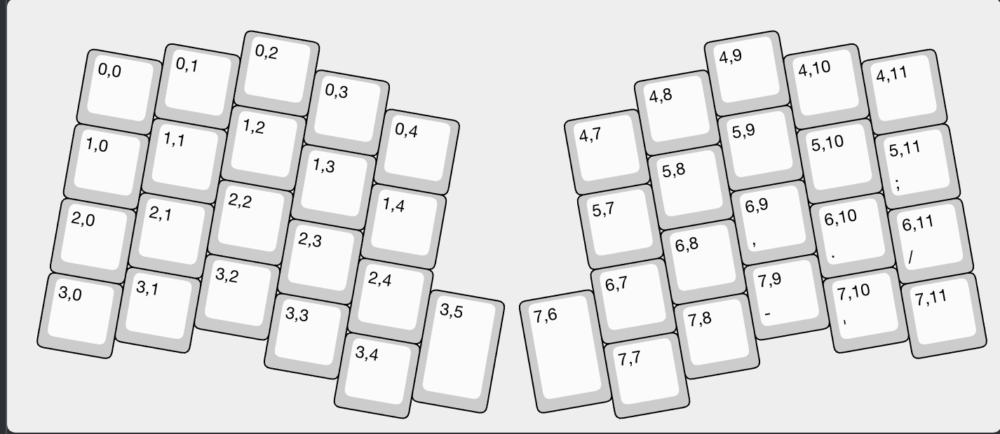
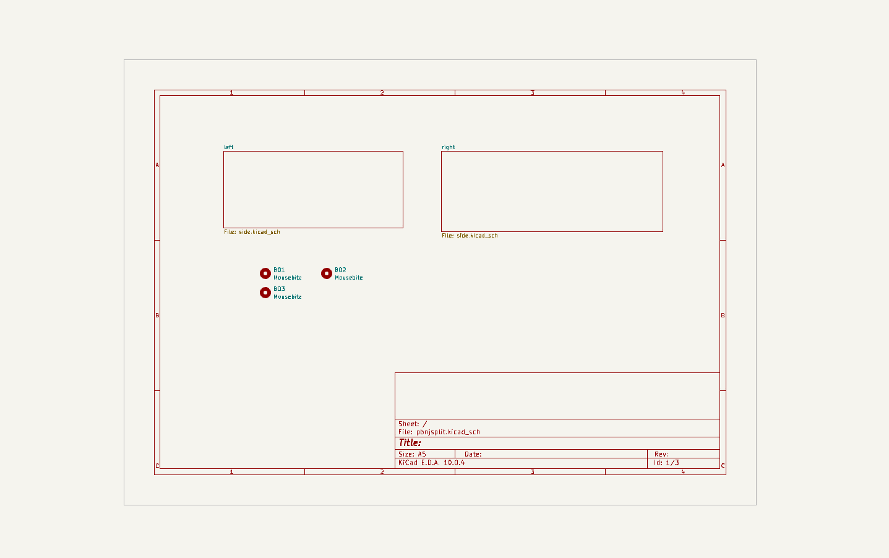
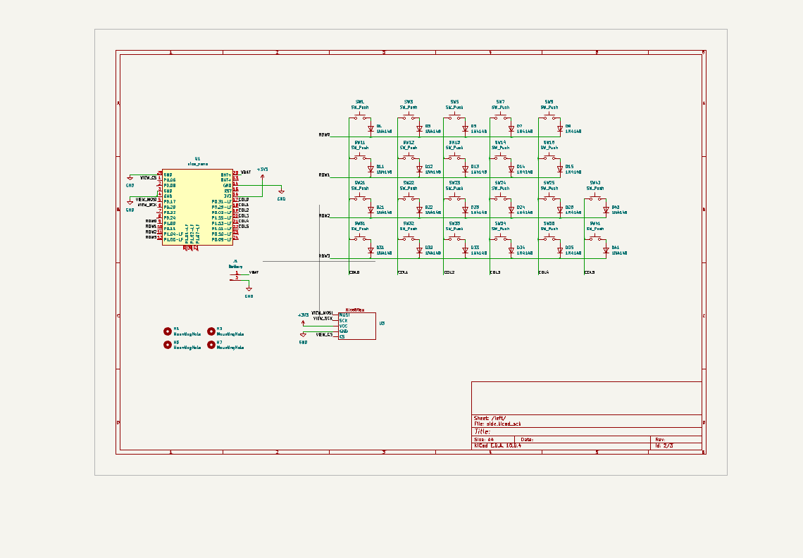
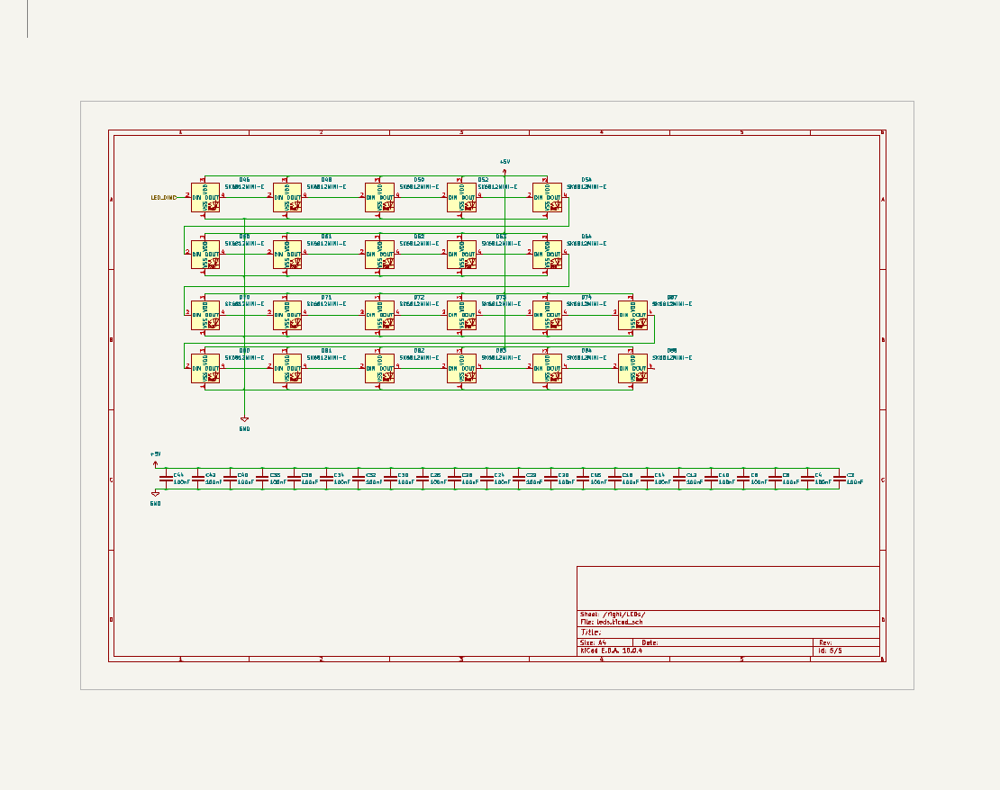

# Sep 24: Made Layout in Keyboard Layout Editor
I made the layout for each half in KLE. Each half will have 22 keys for a total of 44 keys. It will have a layout kinda like the stasis split keyboard tutorial but with a key above the space that I will probably use for layers.

**Total time spent: 2h**

# Oct 3: Made Schematic in KiCad
I made my schematic using a hierarchical sheet for the left and the right side. Because they are symmetric I am using the same sheet for both. I used a nice!nano for the mcu on each side. I also added a nice!view on both sides so I have a cool display on each half. I added 4 mounting holes on each half, so that I could mount it to my case. On the main sheet there is another three mounting holes that I will assign to be mousebites between the halves. For the nice!view I created a custom symbol.

**Total time spent: 2h**

# Oct 4: Added LED Backlights to Each Side
I added a chain of SK6812 LEDs in a subsheet to each side. For each LED, I added 1 100nF decoupling capacitor between +5v and GND that I will place right next to the LEDs. Each LED will be mounted on the south side of the key so that it doesn't interfere with the switch. I considered doing an underglow but then realized that It would not work as well with a case.

**Total time spent: 1h**
